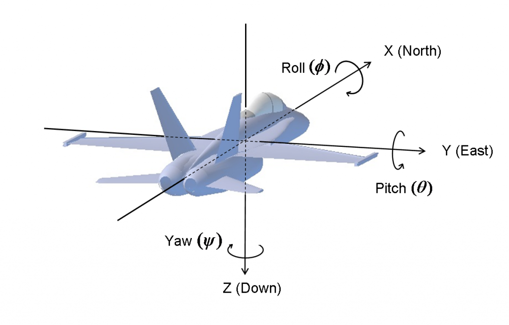
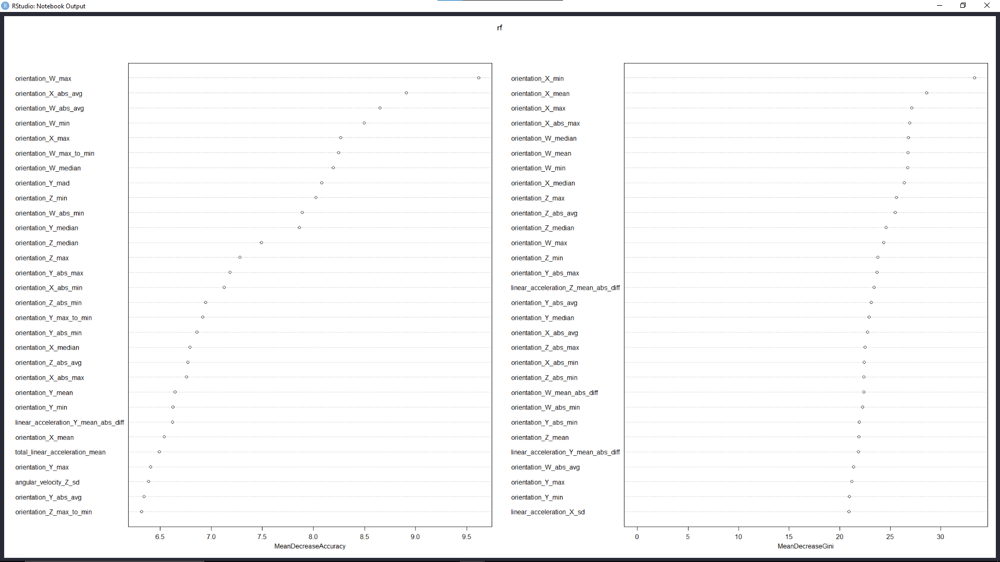

## Floor surface type classification with IMU sensor data

### Project description - https://www.kaggle.com/c/career-con-2019/overview

Robots need to localise in their environment to function autonomously. This involves knowing the orientation; position; environment details such as objects, obstacles, floor type, etc... This helps the robot plan paths and navigate environments efficiently. The floor type identification is tackled in this project.  
If a robot knows what surface its travelling on, it can adjust its motion accordingly (changing speed in hard surfaces, reducing in slippery surfaces and so on).  

Given IMU(Inertial measurement unit) sensor measurements, the task is to identify the surface type that the robot is moving on.  
**This is a sequence classification problem**.  

### Dataset description
The data consists of 3810/3816 (train/test) time series groups, with 128 measurements in each time series.

#### Sensor data
Each time series measurement has the following parameters:  

Quaternions

* `Orientation_x`  
* `Orientation_y`  
* `Orientation_z`  
* `Orientation_w`  

Angular velocities 

* `Angular_velocity_x`  
* `Angular_velocity_y`  
* `Angular_velocity_z`  

Linear accelerations

* `linear_acceleration_x`  
* `linear_acceleration_y`  
* `linear_acceleration_z`  

#### Training and testing files

* `series_id`: ID for time series measurement
* `measurement_number`: measurement number within times

#### Surface types

* Hard tiles with large space
* hard tiles, soft tiles
* fine concrete
* concrete
* soft polyvinyl chloride (PVC)
* tiles
* wood
* carpet

### Objectives

* Get basic domain knowledge about IMU measurements
* Explore features of the data
* Extract basic statistical features for the different surface types
* Utilise KNN, Logistic regression, random forests to try to classifiy the time series data, based on the extracted features
* Apply RNNs like LSTM, which are optimised for modelling sequence data, such as a sensor time series. 


### 3-axis Gyroscope (measures angular velocity in 3 axes)


### Orientation described by Euler angles


### Yaw, Pitch, Roll


```{r setup, include=FALSE}
rm(list=ls())
setwd("D:/VIT/3-2/CSE3506/project")
knitr::opts_chunk$set(echo = TRUE)
```

### Load data
```{r}
X_train <- read.csv("./surface_classification_IMU/X_train.csv")
y_train <- read.csv("./surface_classification_IMU/y_train.csv")
X_test <- read.csv("./surface_classification_IMU/X_test.csv")
sub <- read.csv("./surface_classification_IMU/sample_submission.csv")
```

### Load libraries
```{r}
library(tidyverse)
library(caret)
library(ggplot2)
library(plot3D)
library(ggpubr)
library(Hmisc)
library(superml)
library(moments)
library(zoo)
```

```{r}
glimpse(X_train)
```

```{r}
glimpse(y_train)
```

### Sample sequence

```{r}
series_1 <- X_train %>% filter(series_id == 0)
head(series_1, 10)
```


```{r}
ggplot(series_1, aes(x=measurement_number, y=linear_acceleration_X)) + 
  geom_line() + 
  labs(title="Time series 1, Linear acceleration X")

ggplot(series_1, aes(x=measurement_number, y=linear_acceleration_Y)) + 
  geom_line() + 
  labs(title="Time series 1, Linear acceleration Y")

ggplot(series_1, aes(x=measurement_number, y=linear_acceleration_Z)) + 
  geom_line() + 
  labs(title="Time series 1, Linear acceleration Z")
```

### Analysis

#### Distribution of surface types
```{r}
# cbind(table(y_train$surface
pie(table(y_train$surface))
```

There is imbalance in the surface types.  

### Group Id
#### number for all of the measurements taken in a recording session. Provided for the training set only, to enable more cross validation strategies. 
```{r}
length(unique(y_train$group_id))
```

There were 73 different recording sessions.  

### Visualising data
```{r}
names(X_train)
```

Leave out row_id, series_id, mesurement number from visualisation.  

```{r}
hist.data.frame(X_train[, 4:13])
```

Angular velocity and acceleration columns have a normal distribution, orientation columns are normalised.  


```{r}
library(GGally)
ggcorr(X_train)
```

Orientation X and Orientation Z are very strongly correlated.  


### Transform orientation columns
```{r}
t <- as.numeric(scale(X_train$orientation_X, center = TRUE, scale=TRUE))
mean(t)
sd(t)
hist.data.frame(t)
# head(,)
# glimpse(X_train)
```

### Encode categorical values
#### Convert floor surface type from string to integer

```{r}
# create a label encoder object
lbl <- LabelEncoder$new()
# fit the surface column to the encoder
lbl$fit(y_train$surface)
# convert string to integers
y_train$surface <- lbl$fit_transform(y_train$surface)
y_train$surface <- as.factor(y_train$surface)
glimpse(y_train)

# to decode names use this
# decode_names <- lbl$inverse_transform(sample_dat$column)
```

### Helper functions
#### Change col names of dataframe
Add suffix to all column names of a data frame.  
```{r}
change_names <- function(df, suffix) {
  # preserve Group.1 col for merging later
  new_names = c("Group.1")
  for (colname in names(df)) {
    if(colname %in% c("Group.1")) {
      next
    }
    new_name = paste(colname, '_', suffix, sep='')
    new_names <- append(new_names, new_name, after=length(new_names))

  }
  return (new_names)
}
```


#### Custom aggregation function
Pass in necessary aggregation function, change variable names, remove series and measurement id from data frame.  
```{r}
aggregate_fun <- function(df, fun, suffix) {
  temp <- suppressWarnings(aggregate(df, by=list(series_id), FUN=fun))
  temp$series_id <- NULL
  temp$measurement_number <- NULL
  names(temp) <- change_names(df=temp, suffix=suffix)
  return (temp)
}
```

### Aggregation functions

#### Max to min ratio
```{r}
max_to_min <- function(x) {
  return (max(x) / min(x))
}
# mean difference
mean_abs_diff <- function(x) {
  return (mean(abs(diff(x, differences = 1))))
}
# mean change of absoulte change
mean_diff_of_abs_diff <- function(x) {
  return (mean(diff(abs(diff(x, differences = 1)))))
}
# absolute max, absolute min, absolute avg
abs_max <- function(x) {
  return (abs(max(x)))
}
abs_min <- function(x) {
  return (abs(min(x)))
}
abs_avg <- function(x) {
  return (abs(mean(x)))
}
```

### Add features
Total angular velocity is rms of angular_velocity x, y, z. Same for linear acceleration.  
Acc_vs_vel is the ratio of total linear acc and total angular velocity.  

```{r}
X_train['total_angular_velocity'] = ((X_train$angular_velocity_X ^ 2) + (X_train$angular_velocity_Y ^ 2) + (X_train$angular_velocity_Z ^ 2)) ^ 0.5
X_train['total_linear_acceleration'] = ((X_train$linear_acceleration_X ^ 2) + (X_train$linear_acceleration_Y ^ 2) + (X_train$linear_acceleration_Z ^ 2)) ^ 0.5
X_train['acc_vs_vel'] = X_train['total_linear_acceleration'] / X_train['total_angular_velocity']
```

### Copy the datasets
```{r}
train_df <- X_train
train_df$measurement_number <- NULL
```

### Extract features from sequences
```{r}
# remove row_id, not needed
train_df <- X_train[, 2:16]

attach(train_df)
mean_df <- aggregate_fun(df = train_df, fun = "mean", suffix = "mean")
median_df <- aggregate_fun(df = train_df, fun = "median", suffix = "median")
sd_df <- aggregate_fun(df = train_df, fun = "sd", suffix = "sd")
max_df <- aggregate_fun(df = train_df, fun = "max", suffix = "max")
min_df <- aggregate_fun(df = train_df, fun = "min", suffix = "min")
max_to_min_df <- aggregate_fun(df = train_df, fun = "max_to_min", suffix = "max_to_min")
mean_abs_diff_df <- aggregate_fun(df = train_df, fun="mean_abs_diff", suffix="mean_abs_diff")
mean_diff_of_abs_diff_df <- aggregate_fun(df = train_df, fun="mean_diff_of_abs_diff", suffix="mean_diff_of_abs_diff")
abs_max_df <- aggregate_fun(df = train_df, fun = "abs_max", suffix = "abs_max")
abs_min_df <- aggregate_fun(df = train_df, fun = "abs_min", suffix = "abs_min")
abs_avg_df <- aggregate_fun(df = train_df, fun = "abs_avg", suffix = "abs_avg")

kurt_df <- aggregate_fun(df = train_df, fun = "kurtosis", suffix = "kurtosis")
mad_df <- aggregate_fun(df = train_df, fun = "mad", suffix = "mad")
skewness_df <- aggregate_fun(df = train_df, fun = "skewness", suffix = "skewness")

detach(train_df)

```

#### Features

* total angular velocity (RMS of angular velocities)
* total linear acceleration (RMS of linear acceleration)
* acc vs vel = ratio of total acc and total velocity
* mean
* median
* sd
* max
* min
* absolute max, min, avg
* skewness
* mad = mean absolute deviation
* kurt = kurtosis
* mean_abs_diff = mean of absolute first difference
* max to min = ratio of max to min value in the sequence


### Combine all the feature data frames into one

```{r}
feat = merge(mean_df, sd_df)
feat = merge(feat, max_df)
feat = merge(feat, min_df)
feat = merge(feat, max_to_min_df)
feat = merge(feat, mean_abs_diff_df)
feat = merge(feat, mean_diff_of_abs_diff_df)
feat = merge(feat, abs_max_df)
feat = merge(feat, abs_min_df)
feat = merge(feat, abs_avg_df)
feat = merge(feat, kurt_df)
feat = merge(feat, mad_df)
feat = merge(feat, skewness_df)
feat = merge(feat, median_df)
feat$surface = y_train$surface
```


```{r}
dim(feat)
```

There are 182 features for the sequences.  


#### Remove the grouping attribute from merging

```{r}
feat$Group.1 <- NULL
glimpse(feat)
set.seed(123)
train_samples <- feat$surface %>% createDataPartition(p=0.8,list=FALSE)
x_train <- feat[train_samples, ]
x_test <- feat[-train_samples, ]
y_train <- x_train$surface
y_test <- x_test$surface
x_train$surface <- NULL
x_test$surface <- NULL

```

### Training labels
```{r}
glimpse(y_train)
```


```{r}
library(randomForest)
rf <- randomForest(x=x_train, y=y_train, ntree=100, mtry=2, importance=TRUE)
rf
```

```{r}
# varImpPlot(rf)
```



```{r}
prediction_for_table <- predict(rf, x_test)
# table(observed=y_test, predicted=prediction_for_table)
confusionMatrix(prediction_for_table, y_test)
```

#### Results from random forest
* Accuracy 80.58%
* Sensitivity varies for each class, its lowest for class 7.

```{r}
control <- trainControl(method = "repeatedcv",
                        number = 10,
                        repeats = 3)
metric <- "Accuracy"
set.seed(111)
mtry <- sqrt(ncol(x_train))
tunegrid <- expand.grid(.mtry=mtry)
rf_default <- train(x = x_train, y = y_train, method="rf", metric=metric, tuneGrid=tunegrid, trControl=control)
print(rf_default)
```


```{r}
library("xgboost")
```

### XGBoost
XGBoost is an implementation of gradient boosted decision trees designed for speed and performance.  
#### Parameters: 
* objective: set xgboost to do multiclass classification using the softmax objective. Class is represented by a number and should be from 0 to num_class - 1
* Evaluation metric: **Multiclass classification error rate**.   
```{r}
set.seed(1234)
xgb <- xgboost(data = as.matrix(x_train), 
 label = y_train, 
 eta = 0.1,
 max_depth = 15, 
 nround=25, 
 subsample = 0.5,
 colsample_bytree = 0.5,
 seed = 1,
 eval_metric = "merror",
 objective = "multi:softmax",
 num_class = 12,
 nthread = 3
)
```

##### Train-merror = multiclass classification error rate. 
##### Formula = (no of wrong cases) / (total no of cases)

```{r}
pred <- predict(xgb, as.matrix(x_test))
pred <- as.factor(pred)

print(noquote("Levels of test set"))
print(levels(y_test))
print(noquote("-----------------------------------------"))
print(noquote(("Levels from xgboost")))
print(levels(pred))
print(noquote("-----------------------------------------"))

```

The prediction has levels from 1 to 9, whereas the test set has levels from 0 to 8.  

### Convert levels
```{r}
levels(pred) <- c("0","1","2","3","4","5","6","7","8")
```

```{r}
confusionMatrix(pred, y_test)
```


### Results from XGBoost
* Training time was less, compared to random forest
* Accuracy: 83.8%

### Variable importance
Plot the top 20 important features.  
```{r}
importance_matrix <- xgb.importance(model = xgb)
xgb.plot.importance(importance_matrix = importance_matrix[1:20])
```

### Conclusion
* 83.8% accuracy was achieved on the test set.
* Feature extraction was performed on the data, and the features were used to build a xgboost model


* * * 
